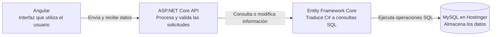

# Movies Manager — CRUD técnico

Aplicación web para administrar películas y directores mediante un CRUD completo. Desarrollada con Angular y TypeScript para la interfaz, C# con ASP.NET Core para la API REST y MySQL para la persistencia de datos.

## Demostración pública

**Aplicación:** [https://movies-app-utxx.onrender.com/movies](https://movies-app-utxx.onrender.com/movies)

**Estado de la API:** `https://movies-app-utxx.onrender.com/health`

## Funcionalidad

- Crear, consultar, actualizar y eliminar películas y directores.
- Relación de uno a muchos entre director y películas.
- Restricción al eliminar directores con películas relacionadas.
- Búsqueda y filtros por nombre, género, director y estado.
- Diseño responsivo para computadora, tableta y teléfono.
- Documentación de la API mediante Swagger.
- Endpoint `/health` para verificar el servicio y la base de datos.

## Arquitectura



En producción, ASP.NET Core aloja Angular y la API en un mismo servicio, utilizando /api para las solicitudes del frontend.

## Tecnologías

| Herramienta | Propósito |
|---|---|
| Angular 20 y TypeScript | Interfaz, formularios, filtros y navegación. |
| ASP.NET Core 8 y C# | API REST, validaciones y reglas del CRUD. |
| Entity Framework Core + Pomelo | Acceso y mapeo de objetos C# hacia MySQL. |
| MySQL | Persistencia de los datos. |
| MySQL Workbench | Ejecución de scripts y revisión de tablas y registros. |
| Swagger | Documentación y prueba de endpoints. |
| Git y GitHub | Control de versiones y repositorio remoto. |
| Docker | Compilación del frontend y backend en una sola imagen. |
| Render | Publicación de la aplicación en una URL HTTPS. |
| Hostinger | Alojamiento de la base de datos MySQL. |

## Estructura

```text
movies-crud-test/
├── backend/MoviesApi/        # API REST en C#
├── database/                 # Scripts SQL
├── frontend/movies-app/      # Interfaz Angular
├── Dockerfile                # Compilación para producción
├── run-local.ps1             # Inicio local automatizado
├── .dockerignore
├── .gitignore
└── README.md
```

## Base de datos

Desde MySQL Workbench:

1. Seleccionar la base de datos.
2. Ejecutar `database/schema.sql`.
3. Opcionalmente ejecutar `database/sample-data.sql`.

Un director puede tener varias películas. Cada película debe tener exactamente un director mediante `Movies.FKDirector`.

| Tabla | Clave primaria | Relación |
|---|---|---|
| `Director` | `PKDirector` | Uno a muchos con `Movies`. |
| `Movies` | `PKMovies` | `FKDirector` referencia a `Director`. |

El campo `Gender` conserva el nombre solicitado en el diagrama original, aunque representa el género de la película.

## Ejecución local
### Configuración de acceso a la base de datos

Por seguridad, el repositorio contiene valores de ejemplo en las variables de conexión definidas al inicio de `run-local.ps1`.

Para ejecutar el proyecto localmente utilizando la base de datos remota de demostración, solicite las credenciales al autor del proyecto y sustituya los siguientes valores:

```powershell
$databaseHost = 'REEMPLAZAR_HOST'
$databasePort = '3306'
$databaseName = 'REEMPLAZAR_NOMBRE_BASE'
$databaseUser = 'REEMPLAZAR_USUARIO'
$databasePassword = 'REEMPLAZAR_CONTRASENA'
```

### Requisitos

- .NET SDK 8.
- Node.js 22 y npm.
- PowerShell 5.1 o superior.
- Una base MySQL accesible con el esquema creado.

### Inicio automatizado

Desde la raíz del repositorio:

```powershell
powershell -ExecutionPolicy Bypass -File .\run-local.ps1
```

El script verifica los requisitos, configura la conexión mediante .NET User Secrets si hace falta, instala dependencias y abre las terminales del backend y frontend.

- Aplicación: `http://localhost:4200`
- API: `http://localhost:5090`
- Swagger: `http://localhost:5090/swagger`

Para detener el proyecto, presionar `Ctrl + C` en cada terminal abierta.

### Ejecución manual

Backend:

```powershell
cd backend/MoviesApi
dotnet restore
dotnet run
```

Frontend, en otra terminal:

```powershell
cd frontend/movies-app
npm install
npm start
```

El proxy de Angular dirige las solicitudes `/api` hacia el backend local.

## Endpoints

| Método | Ruta | Descripción |
|---|---|---|
| `GET` / `POST` | `/api/directors` | Consultar o crear directores. |
| `GET` / `PUT` / `DELETE` | `/api/directors/{id}` | Consultar, actualizar o eliminar un director. |
| `GET` / `POST` | `/api/movies` | Consultar o crear películas. |
| `GET` / `PUT` / `DELETE` | `/api/movies/{id}` | Consultar, actualizar o eliminar una película. |
| `GET` | `/health` | Verificar la aplicación y MySQL. |

## Despliegue público

El proyecto se publicó como un Web Service de Render conectado al repositorio de GitHub:

1. Render construye el `Dockerfile` desde la rama `main`.
2. Docker compila Angular y publica ASP.NET Core.
3. El frontend compilado se copia a `wwwroot`.
4. La cadena de conexión se inyecta mediante `ConnectionStrings__DefaultConnection`.
5. La API se conecta a la base MySQL alojada en Hostinger.
6. Render expone el servicio mediante una URL HTTPS.
7. Cada nuevo `git push` genera un despliegue automático.

Las credenciales no se almacenan en GitHub. Localmente se administran con .NET User Secrets y en Render mediante una variable de entorno secreta.

## Pruebas manuales sugeridas

1. Crear y editar un director.
2. Crear una película relacionada.
3. Probar las búsquedas y filtros.
4. Intentar eliminar el director relacionado; la operación debe ser rechazada.
5. Eliminar la película y después el director.
6. Recargar la página y comprobar la persistencia.
7. Confirmar `database: true` en `/health`.

## Autor

Vladimir Rodríguez Bahena
